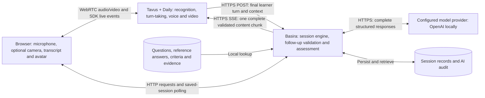

# Basira conversation architecture

Code-traced snapshot: 6 October 2026. Applies to the current source-guided FULL Tavus training journey in local code. It does not claim the latest implementation has been deployed or that legacy routes are identical.

## One exchange

1. The browser creates a Basira session. The engine randomly picks an eligible bank question, excluding questions already asked in the session. A targeted retry deliberately reuses the original question and criteria.
2. Basira creates the Tavus conversation and supplies the selected question as `custom_greeting`. This opening does not need LLM generation. The browser hides the fresh opening until remote playback connects, then reveals its text. A reveal animation does not prove synchronized hearing.
3. Browser audio and optional video travel through the Daily/WebRTC call. Tavus handles speech recognition and turn-taking.
4. Tavus utterance app-messages update display-only partial text. They do not become assessment evidence by themselves.
5. Tavus calls the authenticated Basira custom-LLM endpoint with conversation context and a completed user turn. The server validates the session/call capability and preserves the learner input before model processing.
6. Explicit conversational controls can yield bounded social acknowledgments without a model call. For substantive answers, the configured model proposes a follow-up; a separate model call checks its scope/answerability against the selected criteria and source excerpts. Some paths assess and advance to another question instead.
7. The server waits for completion and validation. Its custom-LLM endpoint then emits one SSE content chunk containing the entire reply, a completion chunk and `[DONE]`. If `stream:false` was requested it returns ordinary completion JSON instead. It does not stream incremental model tokens.
8. Tavus synthesizes and animates the response. The browser receives live media and utterance events; accumulated partial text takes priority over the complete-message reveal animation.
9. The browser reconciles with the canonical saved session through an initial refresh around one second after call entry, then refreshes 1.8 seconds after each previous request completes, plus refreshes triggered by utterance events.
10. After confirmed call stop, end/review/retry requests use ordinary HTTP. The backend saves original and retry attempts with the same reference criteria. Missing evidence is not invented.

## Transport boundaries

| Boundary | Application-level transport | Incremental? |
|---|---|---|
| Browser microphone/camera ↔ Tavus/Daily | Live WebRTC media | Yes: audio/video |
| Partial transcripts, speech events, typed in-call messages, interruption | Daily SDK `app-message` events | Yes: events/utterance chunks |
| Browser ↔ Basira | HTTP locally, HTTPS when hosted | Complete JSON; no custom WebSocket |
| Basira ↔ configured model | HTTPS API requests | Complete structured results; no token streaming |
| Basira → Tavus custom LLM | HTTPS SSE, or JSON when explicitly requested | Currently one complete content chunk, not token-by-token generation |
| Canonical browser transcript | Repeated HTTP session reads | Polling, not server push |
| Browser text reveal | Local React animation | Grapheme reveal only; no network transport |
| Local persistence | SQLite | Ordinary database operations |
| Hosted session/audit persistence | Configured Redis HTTP API | Request/response; no media |

The repository does not construct its own WebSocket for this journey. Daily owns signaling and event transport internals; describing every SDK event as a raw WebSocket would exceed what this code establishes. Ordinary complete HTTP responses may still be split into network packets; “no chunking” here means no application-level incremental token/message delivery.

## Development and production

The local browser connects to the local backend. Tavus must reach that backend over a public HTTPS callback; the development tunnel forwards to the same local runtime. Environment-scoped PAL configuration, records and credentials prevent silently routing development conversations into production. Production uses its configured hosted callback. See [setup](SETUP.md) and [environment deployment](VERCEL.md).

## Sources of truth in code

- `src/VideoCall.tsx`: Daily join, media tracks, app-message events, typed input and interruption.
- `src/liveUtterances.ts`: partial text reconciliation, duplicate/out-of-order events and display-only state.
- `src/ProgressiveText.tsx`: complete-message reveal and reduced-motion support.
- `src/TrainingMeeting.tsx`: polling, canonical history, review and retry transitions.
- `server/app.ts`: `/api/training-llm/chat/completions` and the one-content-chunk SSE response.
- `server/trainingSession.ts`: question selection, persistence, follow-ups, assessments and progression.
- `server/model.ts`: model requests, independent grounding and assessment validation.
- `server/conversationControl.ts`: narrow explicit conversation controls.
- `server/tavus.ts`: conversation creation, opening greeting and cleanup.
- `server/trainingStore.ts`, `server/aiAudit.ts`: persistence and audit.

## Presentation material

Local presentation-only assets are in the gitignored `deliverables/next-presentation/`: browser viewer, Arabic/English diagrams, SVG/PNG exports, Arabic slide copy, recording guide, screenshots and a provenance/acceptance checklist. This technical document is the source-controlled architecture reference. The pack is a dated snapshot, not automatically refreshed when code changes. See [STATUS](STATUS.md) for current acceptance evidence; older sections of other docs describe historical implementations.

For cloud hosting types, production/development topology and actual account-check results, see [HOSTING.md](HOSTING.md).
